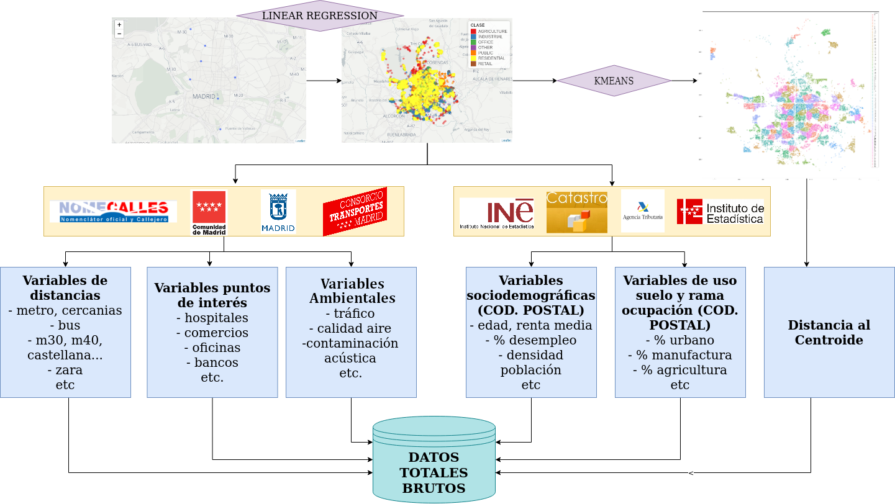
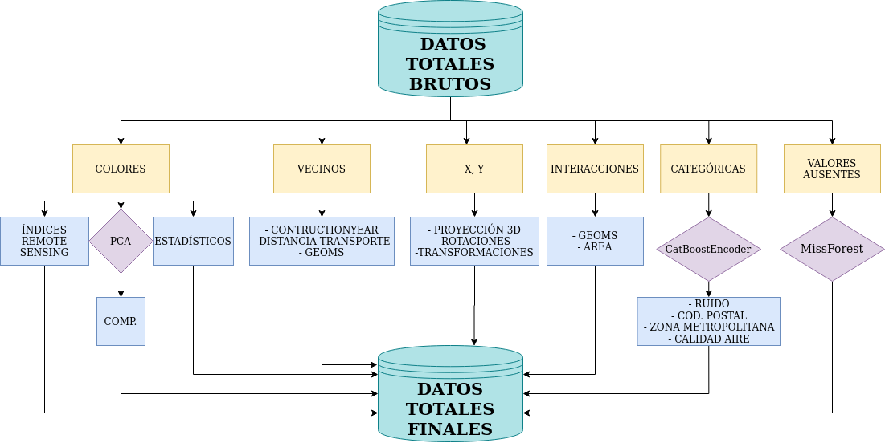
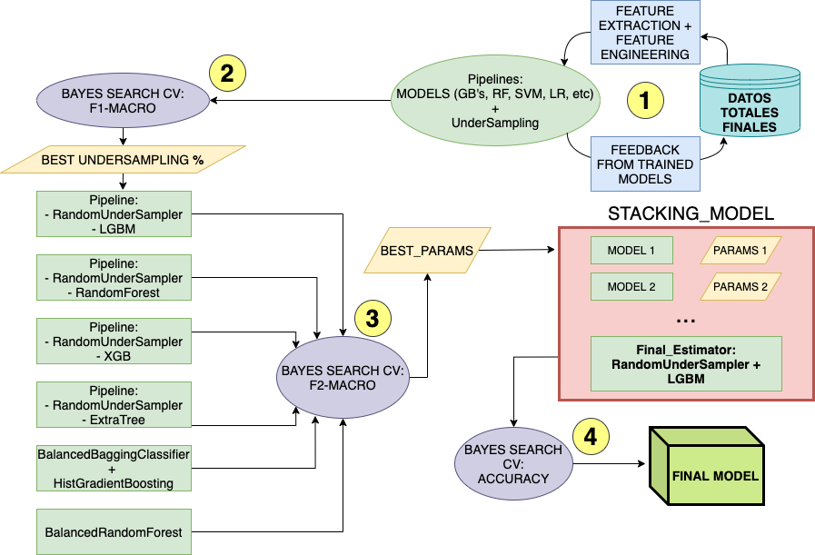

# SentinelAdmins

Código y programas utilizados para ganar el Cajamar UniversityHack 2020, reto Minsait Land Classification. En AFI_SentinelAdmins.pdf, pueden encontrar un resumen del proceso, así como una explicación breve de los programas, que puede ayudar de guía para entender el código. 


## Uso Típico: Sacar predicciones de test sin re-entrenar modelos

Para usar el código: crear entorno y activarlo.
```bash
conda env create -f environment.yaml
conda activate sentinel_env
```
Para desactivar el entorno:
```bash
conda deactivate sentinel_env
```

Desde el terminal, ejecutar:

1. Para obtener la interpolación de la latitud y longitud, además de variables como distancia a Sol, euclídea y en taxi (Manhattan).

```bash
Rscript 01-InterpolacionLatLon.R
```

2. Para obtener las variables geográficas:

```bash
python 02-programa_geovars.py
```

Dependiendo de la máquina tardará un tiempo u otro, pues está programado para utilizar todos los cores disponibles, por lo que de disponer de pocas cpus el tiempo de cálculo será mayor. En caso de necesitar dejar este programa corriendo en background, ejecutar:

```bash
nohup python -u 02-programa_geovars.py > log_programa_geovars.txt &
```

Estos dos programas nos facilitan el proceso que se puede ver en el siguiente diagrama:



3. Para sacar las predicciones sobre el fichero de test:

```bash
nohup python -u 03-sacar_test_stacking.py > log_sacar_test.txt &
```

En este tercer paso va incluido, "under the hood", el proceso de feature engineering, que se puede apreciar



## Jugar con el código: entrenar otros modelos, hacer experimentos o pruebas, etc.

En caso de que se quieran entrenar otros modelos o realizar pruebas, disponemos de muchos scripts para hacerlo. Imaginemos por ejemplo que queremos ver qué tal lo hace una de las arquitecturas de Stacking que tenemos en models.py, por ejemplo StackingAlex1. En tal caso, el comando de entrenamiento sería el siguiente.  

```bash
nohup python -u train_stacking.py --model StackingAlex1 --name Experiment_01 --final_model LGBM --cv 3 --encoder CatBoost > log_train_stacking.txt &
```

Para entrenar modelos simples, y no de stacking, uno puede usar model_trainer_refactor.py, de la siguiente forma:

```bash
nohup python -u model_trainer_refactor.py --model LGBM --name LGBM_01 --use_old False  --iter 100 > log_train_model.txt &
```

Con estos programas se puede emular el sistema de modelización final que está resumido 